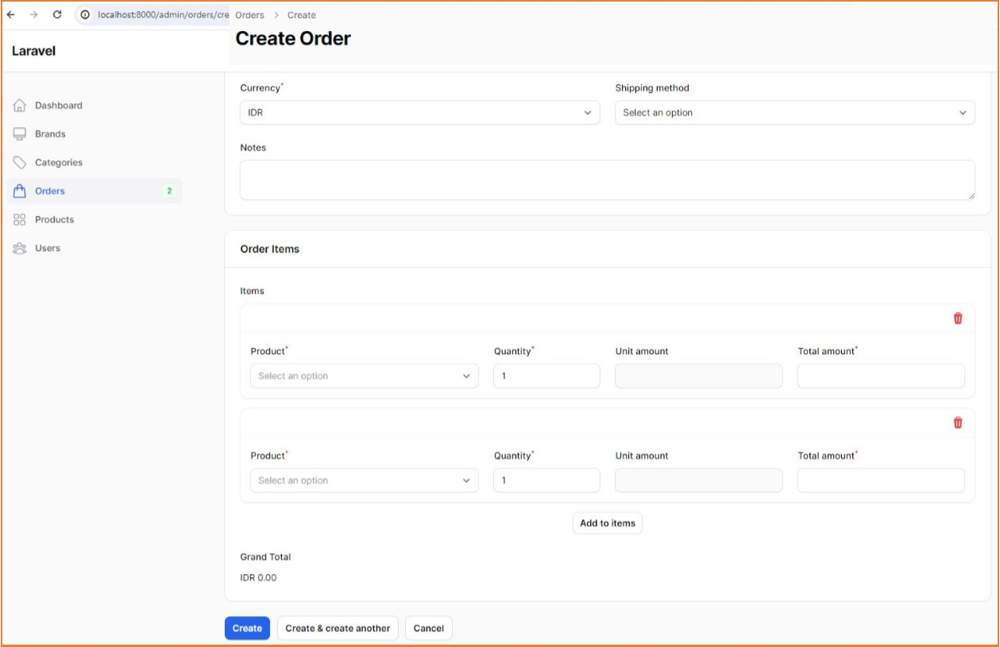

# Project : lar10-Ecommerce 
*********************************************
An Ecommerce/Online Store app using Laravel-10, Filament, Livewire and Tailwind 
 
 
# Notes:
- Started at: Wk1May24 
- Frontend: --
- Backend: [Laravel v.10](https://github.com/maulahaz/) 
- DB: SQLite
- Others: 
    - [Filament v3.2](https://filamentphp.com/docs/3.x/panels/resources/getting-started), 
    - [Livewire v3](https://livewire.laravel.com/docs/quickstart), 
    - [Tailwind],

# References:
- [E-Commerce Project Using Laravel 10, Livewire 3, Filament 3 & Tailwind CSS](https://www.youtube.com/playlist?list=PL6u82dzQtlfv8fJF3gm42TDHJdtA2NDWT)
- [Koleksi Icon: Icons8](https://icons8.com/icons/set/select)
- [Koleksi Icon: HeroIcons](https://heroicons.com/)

# Snapshots:
(https://github.com/maulahaz/lar10-ecommerce)
(https://github.com/maulahaz/lar10-ecommerce)
